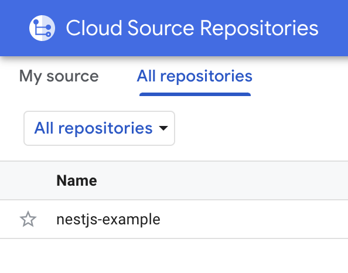

# Auto Init GKE Tool

Automatically initialize Google Kubernetes Engine, Source Repository, and Cloud Build Trigger with
<a href="https://www.terraform.io">Terraform</a>, and create a
<a href="https://nestjs.com">NestJS</a>
example project.

## Step 1 - Initialize GKE

> Open Cloud Shell

```bash
$ cd gke
$ vim variables.tf
```

> Input your GCP project ID


> Run terraform

```bash
$ terraform init
$ terraform apply
```

> Step 1 will create

- A service account named k8s-service-account, please create a new key with json file.
  
  

- A Kubernetes cluster
  
  

## Step 2 - Initialize Source Repository and Cloud Build Trigger

```bash
$ cd trigger
$ terraform init
$ terraform apply
```

> Step 2 will create

- A repository for NestJS example project

  

- A trigger for the repository

  

## Step 3 - Push NestJS example project to the Repository

```bash
$ cd nestjs-example
$ vim cloudbuild/cloudbuild.yaml
```

> Input your GCP project ID


> Push to the repository

```bash
$ git init
$ git add .
$ git commit -m "init"
$ git remote add origin <url>
$ git push -u origin master
```

> Wait for the cloud build process to complete


> Find endpoints in GKE and access


## Update NestJS example project

After the first deployment, you need to modify the cloud build configuration when you push new code.

```bash
$ vim cloudbuild/cloudbuild.yaml
```

> Comment out line 19-36 and uncomment line 41-51


> Push code and see the cloud build process


